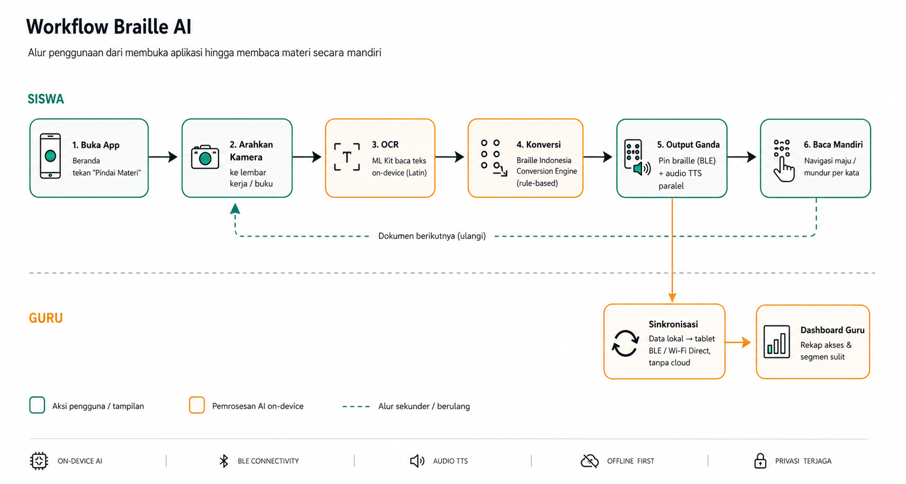
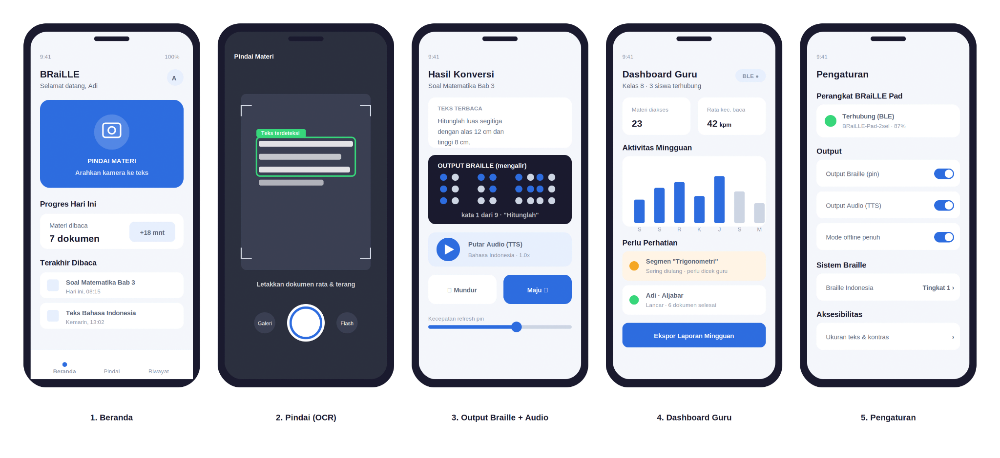
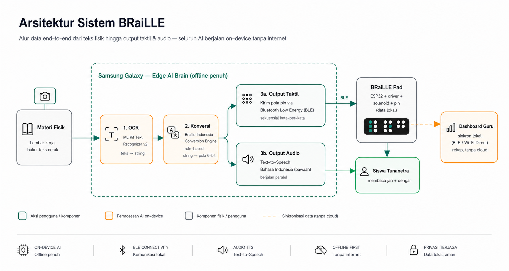
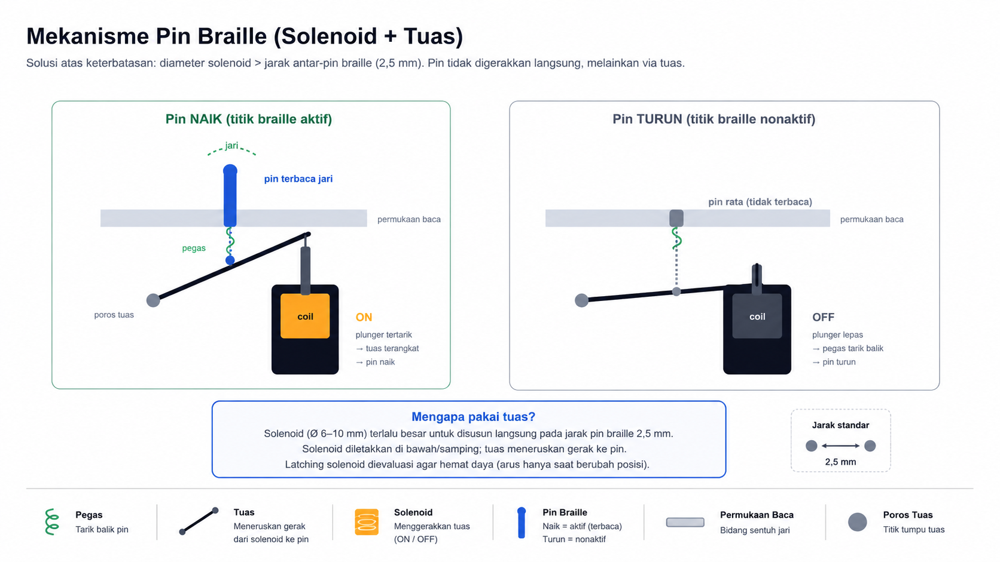
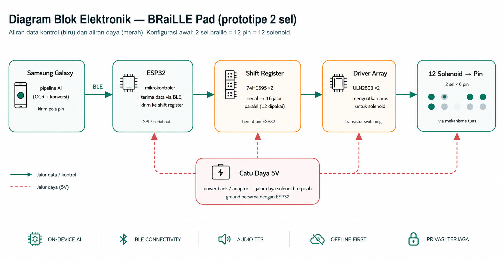

**PROPOSAL IDE/_CONCEPT PAPER_**

# SAMSUNG SOLVE FOR TOMORROW 2026

Tulis ide solusi yang ingin Anda ajukan dengan mengisi kolom-kolom di bawah secara lengkap dan spesifik! Jika ada pertanyaan, silakan hubungi di WhatsApp Enrico (6289677878563) atau di email: [sft2026@dibimbing.id](mailto:sft26@dibimbing.id) atau dapat bergabung ke _community_ Telegram Samsung Solve for Tomorrow 2026 [di sini.](https://t.me/%2Bx1iCtr3VU91hOWRl)

**Nama Tim**

:

DotCode

**Nama Sekolah/Perguruan Tinggi**

:

SMA Regina Pacis Surakarta

**Nama Ketua**

:

Jorge Amadeo Benavides

**Nama Anggota 1**

:

Jorge Amadeo Benavides

**Nama Anggota 2**

:

⁠Kenneth Jehezkiel Marvel Wijaya

**Nama Anggota 3**

:

⁠Josh Pietro Chang

**Nama Anggota 4**

:

⁠Carlos Keiran Indrawan

**Ide/Solusi Pemecahan Masalah**

**1\. Judul Projek/Ide**

BRaiLLE - AI-Powered Tactile Learning for Inclusive Education

1.  **Tema/Bidang yang dipilih**

Education

1.  **Latar Belakang**
    -   **Konteks Masalah (Data & Fakta)**

Di Indonesia, terdapat lebih dari 2,2 juta anak penyandang disabilitas usia sekolah (usia 5–19 tahun). Namun menurut data Kemendikbudristek (Agustus 2021), hanya 12,26% atau sekitar 269.398 anak yang terdaftar dalam pendidikan formal melalui jalur Sekolah Luar Biasa (SLB) dan sekolah inklusi. Dari angka tersebut, siswa dengan disabilitas penglihatan (tunanetra) menghadapi tantangan paling kritis dalam mengakses materi pembelajaran di kelas.

Saat ini, Indonesia memiliki sekitar 2.200 Sekolah Luar Biasa (SLB) dan ribuan Sekolah Inklusi (Sekolah Reguler yang menerima siswa berkebutuhan khusus). Namun kondisi infrastruktur pendidikan inklusif masih sangat tertinggal. Menurut data Kemendikbudristek hingga akhir 2024, hanya sekitar 5% dari total buku pelajaran dan bacaan umum yang telah tersedia dalam format aksesibel seperti braille, buku audio, dan buku digital aksesibel. Artinya, 95% materi pembelajaran tidak dapat diakses oleh siswa tunanetra. Secara global, World Blind Union mengungkapkan bahwa lebih dari 90% karya tulis yang telah terbit tidak dapat diakses oleh penyandang disabilitas netra. Sementara itu, UNICEF Indonesia mencatat bahwa kurangnya pelatihan bagi guru menjadi salah satu tantangan utama pendidikan inklusif di Indonesia. Sementara itu, hampir tidak ada perangkat braille digital yang tersedia atau terjangkau di sekolah-sekolah Indonesia.

Dari sisi teknologi global, perangkat braille yang ada seperti Monarch (HumanWare) atau Orbit Reader dijual seharga $799-18000 (Rp 14-290 juta), jauh melampaui anggaran sekolah maupun keluarga siswa tunanetra di Indonesia. Lebih kritis lagi, tidak ada satu pun perangkat braille digital yang mendukung Bahasa Indonesia atau sistem Braille Indonesia secara khusus.

Akibatnya, guru SLB dan guru pendamping di sekolah inklusi terpaksa mentranskripsi seluruh materi (lembar kerja, soal ujian, buku teks) ke dalam braille secara manual, menghabiskan waktu berjam-jam setiap harinya. Braille AI dapat membantu guru-guru

-   -   **Riset Pengguna (Persona, Kutipan Wawancara)**

**Persona 1: R, 13 tahun  
**Siswa kelas 7 di salah satu SLB-A di Surakarta, sudah memiliki dasar membaca braille namun bergantung penuh pada guru untuk mengakses materi cetak.

_Kutipan wawancara:_ "Paling tidak enak itu kalau harus nunggu. Waktu Bu Guru lagi ngoreksi tugas teman-teman, aku cuma duduk dan bingung mau ngapain. Belum apa-apa sudah ketinggalan pelajaran."

-   **Kebutuhan:** Mengakses dan mengerjakan materi pada waktu yang sama dengan teman sekelas.
-   **Frustrasi utama:** Waktu tunggu yang membuatnya tertinggal dan merasa terpisah dari ritme kelas.

**Persona 2: Bu W, guru pendamping khusus  
**Sembilan tahun mengajar di SLB-A yang sama, memegang delapan siswa yang seluruhnya membutuhkan materi braille secara bersamaan.

_Kutipan wawancara:_ "Untuk membuat satu lembar cetak braille manual, saya butuh waktu dua sampai tiga jam. Itu baru satu lembar kerja, belum termasuk soal ujian. Padahal saya memegang delapan siswa yang semuanya butuh materi pada waktu bersamaan."

-   **Kebutuhan:** Cara mendistribusikan materi ke format braille tanpa mengorbankan waktu mengajar.
-   **Frustrasi utama:** Beban transkripsi manual yang memaksanya memilih antara menyiapkan materi esok hari atau mendampingi siswa hari ini.

**Insight gabungan:** Kedua persona menunjuk pada satu titik masalah yang sama: waktu. Bagi R, waktu tunggu berarti kehilangan momentum belajar. Bagi Bu W, waktu transkripsi berarti kehilangan waktu mengajar. BRaiLLE dirancang untuk memangkas titik tunggu itu di kedua sisi sekaligus.

-   -   **Pernyataan Masalah Inti (How Might We...)**

Bagaimana kita bisa memastikan siswa tunanetra mengakses materi kelas pada waktu yang sama dengan teman sekelasnya?

**4\. Target Pengguna**

-   **Target Pengguna Primer:**

Siswa tunanetra (_low vision dan totally blind_) usia 7–18 tahun di Sekolah Luar Biasa tipe A (SLB-A) dan Sekolah Inklusi di seluruh Indonesia. Khususnya siswa yang sudah memiliki dasar membaca braille namun tidak memiliki akses ke perangkat digital braille karena keterbatasan biaya

-   **Target Pengguna Sekunder:**

Guru SLB-A dan guru pendamping di sekolah inklusi yang saat ini melakukan transkripsi braille manual serta orang tua siswa tunanetra yang mendampingi belajar di rumah

-   **Target Pengguna Tersier:**

Sekolah-sekolah di daerah 3T (Terdepan, Terluar, Tertinggal) yang memiliki siswa tunanetra namun tidak memiliki akses ke fasilitas SLB terdekat

**Skala Potensi:** 2,2 juta penyandang disabilitas usia sekolah di Indonesia. Survei Kesehatan Indonesia (SKI) 2023 mencatat prevalensi disabilitas penglihatan sebesar 0,4% pada penduduk usia di atas 1 tahun, yang pada skala populasi Indonesia berarti sekitar 1 juta jiwa, dengan ratusan ribu di antaranya berada pada usia sekolah.

1.  **Deskripsi Ide**

-   **Konsep Solusi: Penjelasan Umum**

BRaiLLE (dibaca: "Braille A.I.") adalah platform pembelajaran taktil berbasis AI yang mengubah teks cetak Bahasa Indonesia menjadi output braille secara real-time, tanpa koneksi internet, menggunakan perangkat keras berbiaya rendah.

BRaiLLE Pad adalah perangkat _tactile learning_ berbasis meja dengan beberapa _refreshable braille cell_ (pin naik-turun). Berbeda dari layar braille statis berbiaya tinggi yang menampilkan satu baris penuh sekaligus (20–32 sel), BRaiLLE Pad menggunakan pendekatan **aliran sekuensial kata-per-kata pada 16 sel (96 pin)**. Teks ditampilkan secara mengalir mengikuti kecepatan baca siswa, selaras dengan prinsip _Passive Haptic Learning_ (lihat Aspek Science). Pendekatan ini memungkinkan harga produksi sangat rendah (target di bawah Rp 1.000.000) sekaligus berfungsi sebagai alat penguasaan literasi braille, bukan sekadar penampil pasif.

Kamera pada Samsung Galaxy membaca teks dari lembar kerja yang diletakkan di depannya. AI mengonversi teks ke Braille Indonesia dan menggerakkan pin secara berurutan melalui koneksi _Bluetooth Low Energy_ (BLE). Untuk materi panjang, _text-to-speech_ Bahasa Indonesia berjalan paralel sebagai jalur akses kedua.

BRaiLLE Pad 16 sel adalah produk Generasi-1 yang fokus pada keterjangkauan dan literasi. Arsitektur AI yang sama dirancang agar dapat diskalakan ke versi baris penuh atau multi-baris (32 sel ke atas) pada generasi berikutnya seiring penurunan biaya komponen, tanpa mengubah mesin konversi inti.

-   **Fitur Utama**

**_Real-Time OCR_ Bahasa Indonesia:** Membaca teks cetak dalam Bahasa Indonesia menggunakan ML Kit Text Recognition v2 (dari Google) yang berjalan sepenuhnya _on-device_ pada Samsung Galaxy. Fase selanjutnya bisa dikembangkan dengan mengeksplorasi fine-tuning model untuk tulisan tangan dan teks papan tulis menggunakan EasyOCR/Tesseract yang dilatih pada dataset teks sekolah Indonesia.

**_Braille Indonesia Conversion Engine:_** Mengonversi teks ke sistem Braille Indonesia melalui algoritma deterministik berbasis aturan linguistik. Celah ini tidak dimiliki oleh produk manapun yang ada di pasaran saat ini.

**_Offline-Capable:_** Seluruh proses AI berjalan tanpa koneksi internet, yang merupakan kebutuhan kritis untuk sekolah di daerah 3T.

**_Dual Output Mode:_** Teks disampaikan secara taktil (braille) dan audio (_text-to-speech_ Bahasa Indonesia) secara bersamaan, memberikan dua jalur aksesibilitas sekaligus.

**_Teacher Dashboard:_** Guru mendapat laporan otomatis tentang akses materi dan kemajuan belajar siswa tanpa usaha ekstra.

**_Voice Answer_ (Jawaban Suara):** BRaiLLE tidak hanya menyalurkan materi ke siswa, tetapi juga menyalurkan jawaban siswa kembali ke guru. Setelah membaca soal pada pad braille, siswa menjawab secara lisan. _Speech recognition_ Bahasa Indonesia _on-device_ mengubah jawaban tersebut menjadi teks yang otomatis tercatat per nomor soal dan terkirim ke dashboard guru. Guru menerima jawaban dalam bentuk teks biasa tanpa perlu membaca tulisan braille siswa atau mentranskripsi ulang. Dengan ini, siswa tunanetra dapat membaca soal dan mengerjakannya secara mandiri dalam satu alur, tanpa menunggu bantuan di kedua sisi.

-   **Rancangan Awal: User Flow**

**User Flow (BRaiLLE Pad):**

1.  Guru mencetak atau menyiapkan lembar kerja/buku teks seperti biasa.
2.  Siswa menaruh materi di depan kamera BRaiLLE Pad (kamera Samsung Galaxy yang terpasang pada dudukan).
3.  AI pada Samsung phone/tablet membaca teks melalui OCR Bahasa Indonesia.
4.  Sistem mengonversi teks ke kode Braille Indonesia menggunakan algoritma pemetaan deterministik.
5.  Pin braille pada pad naik-turun membentuk karakter braille. Siswa membaca dengan jari.
6.  Siswa menavigasi konten menggunakan tombol maju/mundur pada pad.

6a. Untuk soal latihan, siswa menjawab secara lisan; _speech recognition on-device_ mencatat jawaban sebagai teks per nomor soal.

1.  Guru menerima notifikasi di Samsung tablet: materi apa yang diakses, kata mana yang diulang, jawaban siswa per soal, dan rekap kemajuan mingguan.

**Tampilan wireframe sederhana:**

**6\. Tujuan**

-   Memberikan akses real-time terhadap konten kelas kepada siswa tunanetra di sekolah inklusi Indonesia secara mandiri, tanpa ketergantungan pada guru atau teman sebaya.
-   Mengurangi beban kerja guru pendamping dengan mengotomatiskan proses transkripsi braille yang saat ini dilakukan secara manual berjam-jam setiap harinya.
-   Menyediakan perangkat braille digital pertama yang mendukung Bahasa Indonesia dan sistem Braille Indonesia dengan harga yang terjangkau (target di bawah Rp 1.000.000 per unit untuk perangkat Generasi-1 (16 sel)).
-   Mendukung implementasi kebijakan pendidikan inklusif Indonesia (Permendiknas No. 70 Tahun 2009) dengan solusi teknologi yang konkret dan dapat diskalakan.
-   Membangun rekam jejak pembelajaran pertama untuk siswa tunanetra di sekolah inklusi Indonesia melalui dashboard guru berbasis Samsung Galaxy.

**7\. Inovasi**

-   **Mesin Konversi Braille Indonesia, Pertama yang Terintegrasi OCR Real-Time:** Inovasi inti kami bukan pada OCR (ML Kit sudah mengenali aksara Latin Bahasa Indonesia), melainkan pada _Braille Indonesia Conversion Engine_, yaitu mesin pemetaan deterministik yang menangani aturan Braille Indonesia (indikator angka, indikator kapital, tanda baca, dan singkatan nasional) dan mengintegrasikannya dengan OCR _on-device_ secara real-time. Tidak ada perangkat komersial yang menggabungkan keduanya untuk konteks Bahasa Indonesia.
-   **Jauh Lebih Murah dari Alternatif Terdekat:** Perangkat braille digital termurah (Orbit Reader 20) dijual ~$799 USD (~Rp 14 juta). Perangkat multi-baris HumanWare Monarch dijual ~$17.995 USD (~Rp 290 juta) dengan layar 10 baris × 32 sel. BRaiLLE Pad Generasi-1 ditargetkan di bawah Rp 1.000.000 dengan memakai aktuator _solenoid_ berbiaya rendah dan arsitektur aliran sekuensial, mengadopsi semangat _low-cost actuation_ yang dipelopori prototipe dotFlow (C2I Young Innovator Award 2024).
-   **Membaca Teks Fisik:** Tidak seperti _screen reader_ yang hanya membaca teks digital, BRaiLLE menggunakan kamera dan AI untuk membaca teks fisik seperti lembar kerja cetak, buku teks, dan slide proyektor. Ini adalah celah yang tidak diatasi oleh teknologi assistive yang ada saat ini.
-   **Platform _Scalable_:** BRaiLLE adalah platform AI, yaitu satu mesin konversi OCR + Braille Indonesia yang dapat digunakan untuk berbagai form factor hardware (Pad dan pengembangan selanjutnya). Setiap produk baru tidak membutuhkan AI baru, hanya hardware delivery method yang berbeda.
-   **Dipilih Melalui Eliminasi Alternatif:** Sebelum menetapkan desain ini, kami mempertimbangkan tiga alternatif. (1) _Audio-only_ berbasis TTS, ditolak karena tidak membangun literasi braille dan tidak dapat digunakan saat guru sedang menjelaskan secara lisan. (2) _Embosser_ braille portabel, ditolak karena biaya perangkat dan konsumsi kertas yang berkelanjutan. (3) Tampilan braille satu baris penuh 20 sel, ditolak karena biaya aktuator akan mendorong harga jauh melewati jangkauan dana BOS. Melalui matriks _impact/effort_, arsitektur aliran sekuensial 16 sel memberikan dampak literasi tertinggi dengan biaya terendah, sehingga dipilih sebagai desain Generasi-1.

**8\. Dampak Ide/Proyek**

-   **Dampak Pendidikan:** Siswa tunanetra di sekolah inklusi dapat mengikuti pelajaran yang sama, di kelas yang sama, pada waktu yang sama, tanpa bantuan siapapun. Untuk pertama kalinya, mereka memiliki akses setara ke konten kelas secara real-time.
-   **Dampak bagi Guru:** Mengeliminasi 2–3 jam transkripsi manual per hari yang saat ini dilakukan guru pendamping. Waktu tersebut dapat dialihkan ke persiapan metode pengajaran yang lebih baik.
-   **Dampak Sosial - SDG 4 (Quality Education):** BRaiLLE secara langsung berkontribusi pada Target 4.5 SDG, yaitu memastikan akses yang setara ke pendidikan bagi penyandang disabilitas. Dengan target harga produksi massal Rp 1.000.000, perangkat ini dapat dijangkau oleh program BOS (Bantuan Operasional Sekolah) dan dibeli secara mandiri oleh keluarga. Investasi pada pendidikan inklusif juga berkontribusi pada peningkatan Human Capital Index Indonesia (0,54 pada 2020 menurut World Bank), karena setiap anak yang memperoleh akses belajar setara adalah tambahan langsung pada modal manusia bangsa.
-   **Dampak Sosial - SDG 10 (Reduced Inequalities):** Mengurangi kesenjangan pendidikan antara siswa berkebutuhan khusus dengan siswa reguler, khususnya di daerah 3T yang tidak memiliki SLB terdekat.

**Skala Dampak:** 2,2 juta anak penyandang disabilitas usia sekolah di Indonesia, sekitar 2.200 SLB aktif, dan ribuan sekolah inklusi di 514 kabupaten/kota seluruh Indonesia.

**9\. Aspek STEM**

**Science:** Menerapkan ilmu neurosains kognitif, khususnya _Passive Haptic Learning (PHL)_ dari riset Georgia Tech (Seim et al., ISWC 2014), yang membuktikan bahwa pola sentuhan berulang pada ujung jari membangun memori motorik braille secara _subconscious_. BRaiLLE Pad memanfaatkan prinsip ini: saat siswa membaca pin braille secara berulang pada kecepatan mereka sendiri, memori motorik taktil terbentuk secara bertahap, mempercepat penguasaan alfabet braille dibandingkan metode konvensional.

**Technology:** Penggunaan ML Kit Text Recognition v2 (Google) untuk OCR Latin-script yang berjalan sepenuhnya _on-device_ pada Samsung Galaxy tanpa koneksi internet. Menggunakan arsitektur model ringan (MobileNet-based) yang dapat dieksekusi pada prosesor Exynos/Snapdragon untuk mencapai target latensi < 3 detik. Pada fase selanjutnya, model OCR akan di-fine-tune menggunakan dataset teks cetak sekolah Indonesia (font, layout lembar kerja, format soal ujian) untuk meningkatkan akurasi.

**Engineering:** Perancangan mekanik sel braille refreshable berbiaya rendah menggunakan solenoid mini sebagai aktuator. Karena jarak antar-pin braille standar hanya 2,5 mm (lebih kecil dari diameter solenoid komersial), pin tidak digerakkan langsung oleh solenoid, melainkan melalui mekanisme transmisi: solenoid ditempatkan di bawah/menyamping dan menggerakkan pin via tuas (lever) sehingga kerapatan pin tetap sesuai standar. Untuk efisiensi daya, kami mengevaluasi penggunaan _latching solenoid_ yang hanya menarik arus saat berubah posisi, bukan saat menahan. Prototipe awal menggunakan 16 sel (96 pin) yang dikontrol mikrokontroler ESP32 melalui _shift register_ (74HC595) dan _driver array_ (ULN2803), terhubung ke Samsung Galaxy via Bluetooth Low Energy. _Casing_ dicetak dengan 3D printer. Pengujian Fase 2 akan mengukur tiga metrik: keberhasilan naik-turun pin (>95%), kecepatan refresh (<1 detik per karakter), dan ketahanan pin terhadap tekanan jari pembaca. Pendekatan aktuasi taktil berbiaya rendah ini sejalan dengan arah riset antarmuka haptik terkini (Ozioko et al., _Advanced Intelligent Systems_, 2022) yang menunjukkan bahwa umpan taktil terprogram merupakan kanal komunikasi yang efektif bagi penyandang disabilitas sensorik.

**Mathematics:** Pengkodean karakter Braille Indonesia menggunakan matriks biner 6-bit (2⁶ = 64 kombinasi karakter unik). Algoritma pemetaan karakter Bahasa Indonesia ke kode braille, termasuk penanganan: number indicator (prefix angka), capital indicator (prefix huruf kapital), karakter khusus dan tanda baca dalam sistem Braille Indonesia, serta logika segmentasi teks (kata per kata, baris per baris) untuk ditampilkan secara sekuensial pada sel braille yang terbatas.

**10\. Kontribusi AI**

**OCR Bahasa Indonesia Real-Time:** Model AI visi komputer (ML Kit Text Recognition v2 untuk Fase 1; dengan rencana fine-tuning berbasis EasyOCR/Tesseract pada dataset teks sekolah Indonesia untuk Fase 2) mengenali teks cetak dari input kamera secara real-time. AI ini merupakan komponen inti yang memungkinkan BRaiLLE membaca materi cetak, bukan hanya teks digital.

**Braille Indonesia Conversion Engine:** Algoritma konversi deterministik berbasis aturan linguistik Bahasa Indonesia yang memetakan teks ke kode Braille Indonesia, termasuk penanganan kata majemuk, imbuhan (awalan/akhiran), tanda baca khas Bahasa Indonesia, dan penyesuaian konteks kalimat. Komponen ini bersifat rule-based dan bekerja downstream dari output OCR.

**Samsung Galaxy sebagai _Edge AI Brain_:** Samsung Galaxy phone/tablet bertindak sebagai pusat komputasi AI, menjalankan seluruh pipeline (kamera input → OCR → konversi braille → output ke hardware via BLE) secara lokal tanpa cloud. Ini memungkinkan operasi offline penuh, yang merupakan kebutuhan kritis untuk sekolah di daerah tanpa internet.

**Teacher Dashboard AI Analytics:** AI menganalisis pola penggunaan siswa, termasuk kata-kata yang sering diulang (proxy untuk konten yang sulit dipahami), kecepatan baca per sesi, dan tren kemajuan dari waktu ke waktu, untuk menghasilkan rekomendasi kepada guru secara otomatis. Seluruh pemrosesan AI berjalan offline di perangkat. Data penggunaan disimpan lokal di perangkat siswa, lalu disinkronkan ke tablet guru melalui koneksi langsung BLE atau Wi-Fi Direct saat kedua perangkat berdekatan, tanpa melalui cloud. Dengan demikian operasi tetap sepenuhnya offline sementara guru tetap menerima rekap.

**_Text-to-Speech Fallback_:** AI _text-to-speech_ Bahasa Indonesia dapat berjalan secara paralel sebagai output audio, memberikan siswa dua modalitas aksesibilitas (taktil + audio) dari satu input yang sama.

**_Speech Recognition_ Bahasa Indonesia _On-Device_:** Model AI pengenalan suara (Android _SpeechRecognizer_ dengan mode _offline_) mengubah jawaban lisan siswa menjadi teks secara _real-time_. Jawaban tercatat per soal dan disinkronkan ke dashboard guru melalui jalur BLE/Wi-Fi Direct yang sama, tanpa cloud. Bersama OCR, ini menjadikan BRaiLLE memiliki alur dua arah berbasis AI: materi masuk ke siswa melalui jalur visual (OCR ke braille), dan jawaban siswa keluar melalui jalur audio (suara ke teks), sehingga seluruh siklus membaca dan menjawab berlangsung mandiri.

**11\. Sustainability**

**Keterjangkauan sebagai Fondasi:** Dengan target harga produksi massal Rp 1.000.000 per unit, BRaiLLE Pad masuk dalam anggaran BOS (Bantuan Operasional Sekolah) yang dialokasikan untuk peralatan pembelajaran. Ini menciptakan jalur distribusi berkelanjutan melalui mekanisme pendanaan yang sudah ada tanpa bergantung pada donasi.

**Potensi Kemitraan Strategis:** Rencana kerja sama dengan Kemendikdasmen (Kementerian Pendidikan Dasar dan Menengah), Yayasan Tunanetra Indonesia, dan SLB-A percontohan di beberapa kota untuk pilot program dan distribusi awal. Potensi kemitraan dengan Samsung Indonesia untuk integrasi ekosistem Galaxy sebagai platform AI.

**Open Platform untuk Pengembangan Komunitas:** Model AI OCR + Konversi Braille Indonesia akan dipublikasikan sebagai open-source setelah kompetisi, memungkinkan komunitas developer, mahasiswa, dan NGO (Non-Governmental Organization) untuk membangun produk baru di atas platform BRaiLLE tanpa perlu memulai dari nol.

**Skalabilitas Produk:** BRaiLLE adalah platform, bukan satu produk. BRaiLLE Pad adalah produk pertama; platform yang sama dapat diperluas ke BRaiLLE Book (buku teks digital braille), BRaiLLE Exam (sistem ujian inklusif), dan lainnya, yang semuanya berbagi satu AI engine yang sama.

**Alignment dengan Kebijakan Nasional:** BRaiLLE secara langsung mendukung implementasi Permendiknas No. 70 Tahun 2009 tentang Pendidikan Inklusif dan Rencana Aksi Nasional Penyandang Disabilitas 2021–2024 (dan kelanjutannya yang sedang berlaku), menempatkan solusi ini sebagai mitra kebijakan, bukan sekadar produk teknologi.

**Pertimbangan Etis:** Kamera pada BRaiLLE hanya aktif saat siswa secara fisik menempatkan dokumen di depan perangkat dan tidak merekam video maupun menyimpan gambar. Seluruh pemrosesan AI dilakukan _on-device_ tanpa mengirim data ke cloud, sehingga privasi siswa terjaga sepenuhnya. Teacher dashboard hanya menampilkan statistik agregat (materi yang diakses, kata yang diulang, kecepatan baca), bukan konten dokumen atau rekaman kamera.

Sebagai prinsip desain, BRaiLLE diposisikan sebagai pelengkap dan bukan pengganti tunggal: jika perangkat gagal di tengah pelajaran, jalur TTS pada Galaxy tetap tersedia dan guru dianjurkan menyimpan cadangan materi braille cetak, sehingga siswa tidak pernah berada dalam kondisi lebih buruk daripada sebelum menggunakan BRaiLLE.

Input suara siswa diproses sepenuhnya _on-device_ dan hanya hasil transkripsi teks yang disimpan; rekaman audio tidak pernah disimpan maupun dikirim keluar perangkat.

**Silahkan deskripsikan hal lain (jika ada) di bawah ini!**

**Analisis Risiko & Mitigasi**

**Risiko**

**Dampak**

**Mitigasi**

Akurasi OCR turun pada font/tulisan tangan tidak standar

Teks salah baca

Generasi-1 fokus teks cetak standar; _text-to-speech_ sebagai _fallback_; _fine-tuning_ dataset sekolah pada Fase 2

_Solenoid_ macet, aus, atau kerapatan pin tidak presisi

Karakter tidak terbaca

Desain pin modular yang dapat diganti; mekanisme tuas; pengujian ketahanan Fase 2

Biaya komponen melebihi target Rp 1.000.000

Produk tidak terjangkau

Pengadaan komponen massal; mulai dari 16 sel; evaluasi aktuator alternatif

Guru/siswa enggan mengadopsi alat baru

Adopsi rendah

Desain antarmuka 1–2 tombol; modul pelatihan singkat; pendampingan pilot

Ketergantungan pada satu merek/perangkat

Skalabilitas terbatas

Aplikasi dirancang kompatibel lintas perangkat Android

Perangkat gagal berfungsi di tengah pelajaran

Siswa kehilangan akses materi saat itu juga

Protokol _fallback_ berlapis: TTS pada perangkat Galaxy tetap berjalan tanpa hardware pad; guru menyimpan satu salinan braille cetak atau audio sebagai cadangan; desain pin modular memungkinkan perbaikan cepat

**Strategi & Metode Pengembangan:**

-   **Fase 0 (Riset & Desain).** Sebelum penulisan kode apa pun, tim menyusun fondasi proyek: mempelajari dan mendokumentasikan tabel sistem Braille Indonesia secara lengkap (pemetaan 26 huruf, indikator angka, indikator kapital, tanda baca, dan aturan khusus Braille Indonesia) ke dalam tabel acuan. Tahap ini juga mencakup penyusunan persona pengguna dan perancangan _user flow_ serta arsitektur sistem. Akurasi tabel ini bersifat menentukan, karena seluruh keluaran konversi bergantung padanya.
-   **Fase 1 (Pengembangan Software) (30 Mei - 29 Juli).** Dikerjakan dalam tiga alur:
    -   Pertama, _Braille Indonesia Conversion Engine_. Logika konversi dibangun dan diuji terlebih dahulu dalam Python agar iterasi cepat dan mudah divalidasi terhadap tabel acuan, lalu di-_porting_ ke Kotlin. Mesin ini menerima teks dan mengeluarkan urutan pola pin 6-bit, termasuk penanganan indikator kapital dan angka. Contoh: teks "Adi 14" diproses menjadi indikator kapital → a-d-i → spasi → indikator angka → 1-4. Komponen ini bersifat _rule-based_ (deterministik), bukan AI, karena konversi braille menuntut akurasi mutlak dan tidak boleh "menebak".
    -   Kedua, aplikasi Android + OCR. Aplikasi dibangun di Android Studio menggunakan Kotlin, mengintegrasikan kamera, _ML Kit Text Recognition v2_ untuk OCR, dan API _TextToSpeech_ bawaan Android untuk keluaran audio Bahasa Indonesia. Alurnya: kamera menangkap teks → ML Kit mengubah menjadi _string_ → diteruskan ke _conversion engine_ → ditampilkan sebagai pola braille di layar dan dibacakan via TTS.
    -   Ketiga, pengujian akurasi OCR. Aplikasi diuji dengan 50 sampel lembar kerja dari SLB-A di Surakarta untuk mengukur akurasi pembacaan teks cetak standar, dengan target akurasi di atas 90%. Penting dicatat: pada fase ini ML Kit digunakan sebagaimana adanya tanpa pelatihan model sendiri; 50 sampel dikumpulkan untuk _menguji_ akurasi, bukan untuk melatih model. _Fine-tuning_ model pada dataset sekolah Indonesia diposisikan sebagai pengembangan Fase lanjutan, bukan bagian prototipe ini.
-   **Fase 2 (Prototipe Hardware) (4 Agustus - 1 September).** Dikerjakan paralel dengan software. Pengembangan elektronik dimulai dari membuktikan kontrol satu _solenoid_ dari ESP32 di _breadboard_, lalu menambahkan _shift register_ 74HC595 dan _driver array_ ULN2803 untuk mengontrol enam _solenoid_ sekaligus, serta menguji komunikasi BLE dengan aplikasi Android. Pengembangan mekanik berfokus pada sel braille: tim memulai dari satu sel (6 pin) terlebih dahulu, lalu dua sel, sebelum direplikasi menjadi 16 sel (96 pin) sesuai spesifikasi Generasi-1, dengan mekanisme tuas untuk mengatasi keterbatasan jarak antar-pin 2,5 mm. _Casing_ dicetak 3D dan diiterasi beberapa kali hingga kerapian pin tercapai.
-   **Fase 3 (Integrasi & Pengujian) (2 September - 15 September).** Software dan hardware digabungkan sehingga aplikasi dapat menggerakkan pin fisik via BLE. Dashboard guru sederhana dibangun dengan sinkronisasi data lokal tanpa _cloud_. Terakhir, pengujian pengguna dilakukan bersama 2–3 siswa tunanetra di SLB-A Surakarta untuk mengumpulkan umpan balik kualitatif, disertai pembuatan video demo dan dokumentasi akhir.

**Estimasi Biaya Prototipe:** ESP32 (~Rp 60.000), 96 solenoid linear (~Rp 730.000), komponen driver board/_shift register_ (~Rp 100.000), kabel dan konektor (~Rp 100.000), komponen mekanik pin & tuas ~Rp 50.000 . Total prototipe: ~Rp 1.050.000. Samsung Galaxy phone/tablet diasumsikan sebagai perangkat yang sudah tersedia.

**Perangkat Lunak:** Android Studio, ML Kit Text Recognition v2, Kotlin, Arduino IDE (untuk ESP32), Python (untuk pengembangan algoritma konversi braille).

**Langkah Berikutnya & Dukungan yang Kami Butuhkan**

Untuk membawa BRaiLLE dari konsep ke prototipe teruji, kami membutuhkan: (1) akses ke SLB-A mitra untuk pengujian bersama minimal 5 siswa tunanetra; (2) mentoring teknis pada mekanisme aktuasi pin di kerapatan standar 2,5 mm; (3) perangkat Samsung Galaxy untuk pengujian _pipeline_ AI _on-device_. Dengan dukungan tersebut, kami yakin BRaiLLE dapat menjadi jembatan nyata menuju kelas yang setara bagi siswa tunanetra Indonesia.

**Diagram Arsitektur Sistem:**

**Diagram Mekanisme Pin Braille:**

****

**Diagram Blok Elektronik:**

****

**Referensi & Data Pendukung**

Kementerian Koordinator Bidang PMK (2022). Paparan Menko PMK pada International Conference on Special Education in South East Asia Region (ICSAR) ke-12, Bali, 6 Juni 2022. Data Kemendikbudristek (cut-off Agustus 2021): 2.197.833 anak penyandang disabilitas usia sekolah; 269.398 terdaftar di pendidikan formal (12,26%).

Lestari Moerdijat / MPR RI (2026), mengutip data Kemendikbudristek: hingga akhir 2024, hanya sekitar 5% dari total buku pelajaran dan bacaan umum yang tersedia dalam format aksesibel. World Blind Union: > 90% karya tulis tidak dapat diakses oleh difabel netra. [https://www.mpr.go.id/berita/lestari-moerdijat-akses-buku-penyandang-disabilitas](https://www.mpr.go.id/berita/lestari-moerdijat-akses-buku-penyandang-disabilitas)

UNICEF Indonesia & SMERU Research Institute (2023). Landscape Analysis on Children with Disabilities in Indonesia. Jakarta: UNICEF Indonesia.

World Bank (2020). Human Capital Index Update. Indonesia HCI score: 0.54 (2020), meningkat dari 0.53 (2018). [https://www.worldbank.org/en/country/indonesia/brief/indonesia-human-capital](https://www.worldbank.org/en/country/indonesia/brief/indonesia-human-capital)

Seim, C., Chandler, J., DesPortes, K., Dhingra, S., Park, M., & Starner, T. (2014). Passive Haptic Learning of Braille Typing. Proceedings of the 2014 ACM International Symposium on Wearable Computers (ISWC '14), pp. 111–118. ACM. [https://doi.org/10.1145/2634317.2634330](https://doi.org/10.1145/2634317.2634330)

Alim, M. & Abdelhannane, N. (2024). dotFlow — A Refreshable Braille Display. Winner, C2I Young Innovator Award 2024, The Engineer. Developed through the Maker Challenge, Imperial College London. [https://www.theengineer.co.uk/content/in-depth/c2i-2024-young-innovator-winner-dotflow-a-refreshable-braille-display](https://www.theengineer.co.uk/content/in-depth/c2i-2024-young-innovator-winner-dotflow-a-refreshable-braille-display)

Ozioko, O. et al. (2022). Smart Tactile Gloves for Haptic Interaction, Communication, and Rehabilitation. Advanced Intelligent Systems, 4(4). Wiley. [https://doi.org/10.1002/aisy.202100091](https://doi.org/10.1002/aisy.202100091)

Permendiknas No. 70 Tahun 2009 tentang Pendidikan Inklusif bagi Peserta Didik yang Memiliki Kelainan dan Memiliki Potensi Kecerdasan dan/atau Bakat Istimewa.

Kementerian Kesehatan RI (2024). Survei Kesehatan Indonesia (SKI) 2023: prevalensi disabilitas penglihatan penduduk usia >1 tahun sebesar 0,4%. Disampaikan Plt. Dirjen P2P Kemenkes, Oktober 2024. [https://www.tempo.co/gaya-hidup/angka-gangguan-penglihatan-anak-indonesia-tinggi-ini-kata-kemenkes-1063231](https://www.tempo.co/gaya-hidup/angka-gangguan-penglihatan-anak-indonesia-tinggi-ini-kata-kemenkes-1063231)

**Keterangan Nama Produk:** BRaiLLE dibaca "Braille A.I."

## Notes:

Proposal/_concept paper_ disimpan dalam format **PDF** dengan format penamaan **SFT 2026 - Nama Tim - Asal Sekolah/Perguruan Tinggi.pdf** berukuran **maksimal 4,5 MB** untuk diunggah di [s.id/RegistrasiSFT2026](http://s.id/RegistrasiSFT2026) melalui laman pendaftaran yang tersedia.