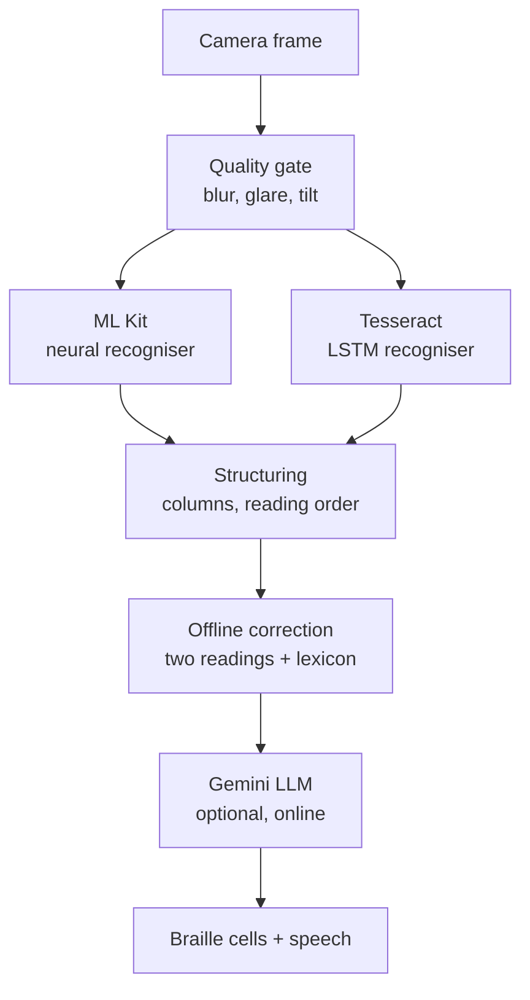

# BRaiLLE OCR — 48-Hour AI Integration Handoff Plan

As of 2026-09-19

## Situation and constraints

The app already works, so the job for the next 48 hours is to make the AI that already runs **visible** and **measured** — not to add more of it.

Three neural networks execute on every capture. A judge watching the demo currently sees none of them: the user taps a button and text appears. Invisible AI scores nothing with general judges, and unmeasured AI scores nothing with technical ones. Every work item below closes one of those two gaps.

| Constraint | Value |
| --- | --- |
| Time remaining | 2 days |
| Judge profile | Mixed — technical and general |
| Rubric weight | AI integration heavily weighted |
| Current accuracy evidence | None publishable — 4 ground-truth pairs committed, 27 unverified samples |

### Hard rules

- No new models. No fine-tuning. No on-device LLM swap. No changes to `ocr-core/pipeline/`.
- No refactoring. If a change is not visible to a judge or does not produce a number, it does not ship this week.
- Commit after each work item completes. Never batch work items into one commit.
- The demo path — capture, recognise, correct, read aloud, send to the pad — is frozen. Work items add surfaces alongside it; they do not alter it.

## What already exists — read before writing any code

More is built than it looks. Several obvious "improvements" are already implemented, and rebuilding them would burn the whole budget. Verify each of these in the repo before starting a work item.

| Capability | Where it lives | Status |
| --- | --- | --- |
| ML Kit recognition (neural, on-device) | `ocr-mlkit/MlKitAdapter.kt` | Working |
| Tesseract LSTM recognition (offline) | `ocr-mlkit/TesseractReader.kt`, `assets/tessdata/{eng,ind}.traineddata` | Working |
| Offline correction layer (second reader + dictionary) | `OcrEngine.CorrectionSettings` | Working |
| Gemini LLM correction (online, optional) | `app/GeminiCorrector.kt` | Working |
| Per-word second reading kept for comparison | `TextWord.secondReading`, `secondConfidence` | Modelled |
| Per-word corrections with original and replacement | `TextBlock.corrections: List<SpellingCorrection>` | Modelled |
| Pre-correction document preserved | `OcrResult.Success.uncorrected` | Working |
| Before/after toggle on the result screen | `ResultScreen.kt` — `showOriginal` state | **Already built** |
| Correction count tags | `CorrectionStatus()` — `offlineFixes(n)`, `geminiChanged(n)` | **Already built** |
| Per-stage timings | `Timings` — `recognizeMs`, `secondReadMs`, `correctMs` | Working, shown in `DetailScreen` `TimingCard` |
| CER/WER computation | `ocr-core/accuracy/ErrorRate.kt` | Working, unit-tested |
| Accuracy harness | `ocr-mlkit/androidTest/OcrAccuracyHarnessTest.kt` | Working, needs data |
| Correction review harness | `OcrCorrectionCorpusHarnessTest.kt` | Working |
| Ground-truth seed dataset | `ocr-mlkit/src/androidTest/assets/ground-truth/` | **Only 4 pairs** |
| Collected samples, unverified | `braille-ocr/dataset/ai-transcribed/` | 27 files, `RAW_OCR` provenance |

### What this means

The before/after toggle exists but **flips between two full texts**, so a judge cannot see *what* changed. That is the real gap, and it is what Work Item 1 addresses — not building a toggle.

The correction data is already modelled per word. `SpellingCorrection(original, corrected)` is populated and sitting unused in the UI except as a count. Work Item 1 is a rendering change over data that already flows.

The accuracy harness is complete and runs on every `connectedDebugAndroidTest`. It reports nothing meaningful because only 4 ground-truth pairs are committed. Work Item 2 is a **data** task, not a code task.

## Work Item 1 — Inline correction highlighting

**Priority: highest. Estimate: 3–4 hours. This is the single biggest demo win.**

A judge must be able to *see* the AI fix an error, in place, without toggling. Right now the correction is a number on a tag and a whole-text flip. The change: render corrected words highlighted inline in the result text, tappable to reveal what the recogniser originally read.

### Why this is cheap

The data is already there. No pipeline change, no model change, no new state in the ViewModel.

- `TextBlock.corrections: List<SpellingCorrection>` gives `original` → `corrected` per block, in reading order.
- `TextWord.secondReading` and `secondConfidence` give the second recogniser's competing reading per word.
- `OcrResult.Success.uncorrected` holds the entire pre-correction document.

### Implementation

1. Add a `CorrectionHighlighting` helper in `app/src/main/kotlin/id/dotcode/braille/ocr/app/`. Given a `TextBlock`, build an `AnnotatedString` where each token matching a `SpellingCorrection.corrected` value carries a background colour and an annotation holding the `original` string.
    - Match on word boundaries in `block.text`, walking `block.corrections` in order so a word corrected twice maps to the right entry.
    - Fall back to plain text when `corrections` is empty — the common case must cost nothing.
2. Modify `ReadingBlock(block, isFirst)` in `ResultScreen.kt` (around line 779) to render the annotated string instead of the plain `block.text`. This composable is already the single rendering path for block text, so one change covers the whole screen.
3. Add tap handling: tapping a highlighted word shows a small popup or inline chip reading `"rumh" → "rumah"`. Reuse `NoticeCard` styling or a `Tag` with `TagTone.Info` rather than introducing a new component.
4. Add a toggle in `CorrectionStatus()` — *"Tampilkan koreksi"* — defaulting **on**, so the highlighting is visible the moment the result screen opens. The demo depends on it being on by default.
5. Add both string variants to `Strings.kt`. The file carries parallel Indonesian and English implementations; a new string needs an entry in the interface and in **both** overrides, or the build breaks.

### Accessibility requirement — do not skip

The primary user is blind. Colour alone carries no information for them, and a screen reader must not read markup noise.

- Set `contentDescription` on corrected spans so TalkBack announces the correction rather than silently reading the fixed word.
- Keep the TTS path (`AudioPlayer`, `SpeechController`) reading the **corrected plain text unchanged**. Highlighting is a sighted-judge affordance layered on top; it must not alter what is spoken or what is sent to the pad.
- Verify `TextExport.toPlainText(document)` output is byte-identical before and after this change.

### Acceptance criteria

- [ ] Corrected words render visibly distinct in the result text, on by default
- [ ] Tapping a corrected word reveals the original reading
- [ ] TTS output unchanged
- [ ] ESP32 pad output unchanged
- [ ] TalkBack announces corrections meaningfully
- [ ] A page with zero corrections renders exactly as it does today

## Work Item 2 — Produce one real accuracy number

**Priority: high. Estimate: 4–5 hours, mostly manual. Parallelisable across the team.**

This is a data task. No new code. The harness already computes CER and WER; it has almost nothing to measure.

### The problem with the current data

The 27 files in `dataset/ai-transcribed/` carry `RAW_OCR` provenance — they are the model's own output, not verified truth. Scoring against them measures nothing. `TrainingSampleStore.kt` documents this rule in its own header: a sample is only fit to score accuracy once a human has read `text.txt` against `image.jpg`, fixed it, and flipped `transcriptionSource` to `HUMAN_CORRECTED`.

### Steps

1. **Pick 25–40 samples.** Prefer images representative of the demo conditions: real classroom worksheets, your demo phone, typical lighting. Skip anything you would not photograph on stage.
2. **Correct them by hand.** Open each `image.jpg`, read `text.txt` against it, fix every character. Split across the team — this is the parallelisable hour. Roughly 5–10 minutes per page.
3. **Flip provenance.** Set `transcriptionSource` to `HUMAN_CORRECTED` in each `meta.json`. The harness and any future training run both depend on this field being honest.
4. **Stage the pairs.** The harness reads image + same-named `.txt` pairs. Either commit them to `ocr-mlkit/src/androidTest/assets/ground-truth/` alongside the existing 4, or push to the device directory.
5. **Run the harness.** It reads every page twice — recogniser alone, then with the offline correction layer — so the layer's effect is measured rather than assumed.

```bash
./gradlew :ocr-mlkit:connectedDebugAndroidTest -Pandroid.testInstrumentationRunnerArguments.class=id.dotcode.braille.ocr.mlkit.OcrAccuracyHarnessTest
```

```bash
adb logcat -d -s OcrAccuracyHarness
```

6. **Record the results** in the table below and put it on a slide.

### Results table — fill this in

| Configuration | CER | WER | Character accuracy | n |
| --- | --- | --- | --- | --- |
| Recogniser only (ML Kit) | | | | |
| + Tesseract second reading and offline correction | | | | |
| + Gemini correction (online) | | | | |

### Gotchas

- Scoped storage hides files another process wrote. If the harness reports zero pairs while `adb shell ls` shows them, run the `appops` grant documented in the test's header comment.
- The harness deliberately does not fail on an empty device directory, and does not pass silently either. A green run that measured nothing is the failure mode to watch for — check the logged pair count.
- **Run this before building the slide.** If the correction layer turns out not to help, you need to know tonight, not on stage. Reporting an honest modest gain beats claiming an unverified large one.

## Work Item 3 — Make the pipeline visible

**Priority: medium. Estimate: 2 hours. Cut this first if time runs short.**

The per-stage timings already exist in `Timings` and already render in `DetailScreen`'s `TimingCard`. The problem is that a judge never opens Detail. Move a compact version of that information onto the result screen, where it will actually be seen.

### What the pipeline actually does



Use this diagram on the architecture slide too. It is the clearest single artefact for showing a general judge that three models are involved.

### Implementation

1. Add a collapsed "Bagaimana ini bekerja" row to the result screen, below `CorrectionStatus`. Expanded, it lists the stages that ran with their measured times, pulled from `document.timings`.
2. Name the models explicitly in the UI copy — *"ML Kit"*, *"Tesseract LSTM"*, *"Gemini"*. A judge who reads "pemrosesan" learns nothing; a judge who reads three model names understands immediately that this is a multi-model system.
3. Show `secondReadWords` when the second recogniser contributed, and say plainly when it timed out. Honest degradation reads better than silence.
4. Reuse `TimingCard`'s formatting logic rather than duplicating it.

### Acceptance criteria

- [ ] Stage names and timings visible from the result screen without leaving it
- [ ] All three model names appear in user-facing copy
- [ ] Collapsed by default so the reading experience is unchanged for the actual user
- [ ] Both `Strings.kt` language variants updated

## Work Item 4 — Narrative, slide, and demo script

**Priority: high. Estimate: 2–3 hours. Zero code. Do not let this slip to the last hour.**

With mixed judges, how the system is described moves the score as much as what it does.

### How to describe the AI

Do not say *"we use Tesseract and Gemini."* That describes a dependency list. Say instead:

> Three neural networks in one pipeline: on-device text recognition (Google ML Kit), an LSTM recogniser that runs fully offline (Tesseract), and a language model that repairs recognition errors using sentence context. The photo never leaves the phone.

Same system, accurately described, lands very differently.

### The three claims to lead with

1. **Offline by design.** The core reading path needs no network. A student in a classroom without data still reads. Every competing project whose AI feature is an API call dies in airplane mode.
2. **Privacy by architecture.** Photos never leave the device; only text is sent when the optional online correction runs. This was a deliberate decision, documented in `GeminiCorrector`'s header.
3. **AI is what makes the device affordable.** Without on-device neural OCR this product needs a server, a data plan, and a subscription. That sentence is what connects "AI integration" to "why this matters" for a general judge.

### Slide deck minimum

| Slide | Content |
| --- | --- |
| Problem | Print inaccessibility, Indonesian-language material underserved |
| Architecture | The mermaid diagram from Work Item 3, three models boxed and labelled |
| Accuracy | The results table from Work Item 2, with n stated |
| Hardware | The 16-cell BRaiLLE Pad, ESP32 over Bluetooth |
| Offline and privacy | The two claims above |

### Demo script

1. **Normal capture.** Photograph a clean worksheet. Text appears, corrections highlighted inline. Point at a highlighted word: *"the recogniser read this wrong, the model fixed it using the sentence around it."*
2. **Airplane mode.** Turn the network off on stage. Capture again. It still works. This is the strongest single moment available to you — rehearse it.
3. **Deliberate hard case.** Use a page you know reads badly: poor lighting, slight fold, tight columns. Show the correction pass rescuing it. Judges remember recovery more than a clean run.
4. **Braille output.** Send to the pad. Let a judge feel the cells move.
5. **The number.** Close on the accuracy table. *"Measured on n pages we transcribed by hand, held out from any tuning."*

### Questions you will be asked

- *"Did you train the model yourself?"* — Answer honestly: no. You integrated three pretrained models and built the document-understanding pipeline, the correction layer, and the hardware path around them. Then say what you measured. An honest "no, and here is what we did build" scores better than a hedge that collapses under one follow-up.
- *"How is this different from Google Lookout or Seeing AI?"* — Refreshable braille hardware output and Indonesian-language focus. Do not claim the OCR is better; claim the output path is different. This question is likely, so have the answer ready.
- *"What is your accuracy?"* — The table. With n. This is why Work Item 2 exists.

## 48-hour schedule

Assumes two or three people. The critical insight is that Work Item 2 is manual and parallelisable, so it should run alongside the coding rather than after it.

| Block | Developer | Everyone else |
| --- | --- | --- |
| Day 1 morning | Work Item 1 — highlighting helper and `ReadingBlock` change | Work Item 2 steps 1–3 — hand-correct 25–40 samples |
| Day 1 afternoon | Work Item 1 — tap handling, strings, accessibility check | Finish corrections, flip provenance, stage pairs |
| Day 1 evening | **Run the harness. Record the numbers.** | Draft slides 1–3 |
| Day 2 morning | Work Item 3 — pipeline visibility | Work Item 4 — slide deck, mermaid diagram |
| Day 2 afternoon | Build final APK, install on demo phone, freeze | Rehearse demo script end to end, twice |
| Day 2 evening | Charge everything. Do not touch code. | Rehearse the Q&A answers |

### Non-negotiable checkpoints

- **End of Day 1: the accuracy number exists.** If it does not, stop all feature work on Day 2 morning and get it. The number matters more than Work Item 3.
- **Day 2 midday: code freeze.** The APK that demos is built before lunch on Day 2. Anything unfinished at that point ships as-is or gets reverted.
- **Day 2 afternoon: two full rehearsals on the actual demo phone**, including airplane mode and the pad connection.

### If you fall behind

Cut in this order: Work Item 3 first, then the tap-to-reveal interaction inside Work Item 1 (keep the highlighting itself), then the third row of the results table. Never cut Work Item 2 or the rehearsals.

## Risks and freeze list

### Do not touch

These are working and on the demo path. Changing them risks the whole presentation for no scoring gain.

- `ocr-core/pipeline/` — all 17 files. The structuring logic is intricate and has no test coverage you can run quickly.
- `OcrEngine` recognition flow and `CorrectionSettings` defaults.
- `Esp32BluetoothSender`, `BraillePad`, `Braille.kt` — the hardware path. A Bluetooth regression discovered on stage is unrecoverable.
- `assets/tessdata/*.traineddata` — no retraining, no swapping.
- `SpeechController` and the TTS path.

### Risk register

| Risk | Likelihood | Mitigation |
| --- | --- | --- |
| Correction layer shows no measurable gain | Medium | Find out Day 1 evening. Report the honest number; lead the narrative on offline and hardware instead |
| Highlighting breaks TTS or pad output | Medium | Acceptance criteria explicitly test both. Verify `toPlainText` is unchanged |
| Harness finds zero pairs (scoped storage) | High | Known issue. Apply the `appops` grant from the test header before the first run |
| Hand-correction takes longer than estimated | Medium | Floor is 25 samples. Stating n honestly is fine; a small n with a real number beats no number |
| Gemini API fails on stage | Medium | Airplane-mode demo already covers this. Frame the offline path as primary and the online pass as a bonus |
| Demo phone battery or pad battery | Low | Charge both the night before. Bring a power bank |
| Last-minute commit breaks the build | Medium | Code freeze Day 2 midday. Keep the frozen APK installed and do not overwrite it |

### Rollback rule

Keep the last known-good APK installed on a second phone, or saved off-device. If anything built after the freeze misbehaves during rehearsal, reinstall the frozen build and demo that. A slightly less impressive demo that runs beats an impressive one that crashes.

### Honesty guardrails

Do not claim you trained or fine-tuned a model. Do not present an accuracy figure without stating n and that the pages were held out. Do not describe the samples as ground truth unless a human actually corrected them. A judge who catches one overstatement discounts everything else you said, and the honest version of this project is already strong.
